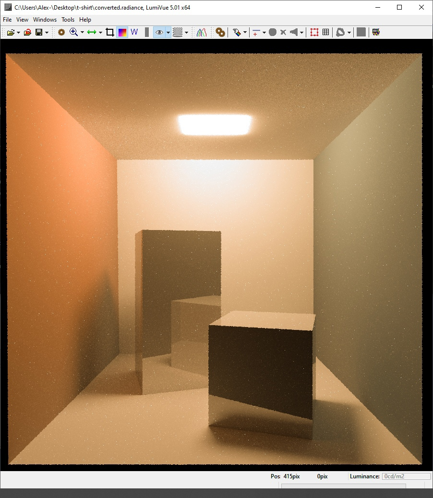

## Creating a Photorealistic Render Engine in C++ Using Monte Carlo and Path Tracing

This is an educational project for ITMO University students. Master's degree.
Creators: Alexander Anikeev, Julia Golovchanskaya, German Gabel, Igor Kinev, Anton Kuznetsov, Stas Kupriyanov, German Goebel and Ruslan Khalimov
