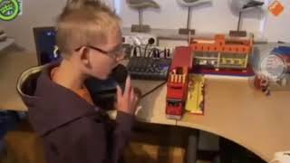

## Okay let's go

1. Сколько длин волн? Минимум.
2. Матрицы с openCV (но ребятам надо подключить)
3. Кто рассчитывает отажения у луча

Header
1. Геометрия (почему у геометрии нет функции запустить луч?)
2. Луч
3. Камера
4. Источник света
5. Оптические свойства (как задавать брдф)
6.  Сцена
7. Математика (нужны ли будут только умножения?) Вообще нужен ли он

